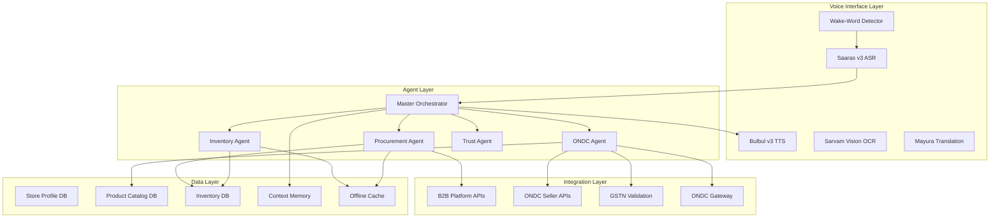

# Design Document: Swar-Vani Procurement System

## Overview

The Swar-Vani Procurement System is a multi-agent AI platform that enables Indian SMEs and kirana stores to manage procurement, inventory, and ONDC marketplace operations through vernacular voice interfaces. The system addresses the digital divide by eliminating complex UIs and enabling natural language interactions in 22 Indian languages.

The architecture follows an orchestrator-specialist pattern where a master Orchestrator agent receives voice input, decomposes goals into subtasks, and delegates to four specialist agents: Procurement Agent, Inventory Agent, ONDC Agent, and Trust Agent. Each specialist has domain-specific knowledge and integrates with external services (B2B platforms, ONDC network, speech services).

Key design principles:
- Voice-first interaction with multilingual support and code-mixing
- Agentic autonomy with human-in-the-loop safeguards
- Real-time synchronization with external platforms
- Offline capability for critical operations
- Trust and governance through budget enforcement and authentication

## Architecture

### System Components



### Agent Responsibilities

**Master Orchestrator Agent:**
- Receives voice input from ASR service
- Parses intent using LLM-based natural language understanding
- Decomposes complex goals into subtasks
- Delegates subtasks to specialist agents
- Aggregates results from multiple agents
- Maintains conversation context and state
- Generates audio responses via TTS service
- Implements fallback strategies for agent failures

**Procurement Agent:**
- Integrates with B2B platforms (Udaan, Jumbotail, local distributors)
- Performs real-time price discovery across multiple suppliers
- Calculates total cost including delivery fees
- Identifies bundle discount opportunities
- Monitors commodity market pricing trends
- Generates draft purchase orders using EOQ model
- Executes approved purchase orders via B2B APIs
- Tracks order status and delivery

**Inventory Agent:**
- Tracks real-time stock levels for all SKUs
- Calculates reorder points using formula: R = (d × L) + SS
  - d = daily demand rate
  - L = lead time in days
  - SS = safety stock
- Forecasts demand using historical sales, seasonal patterns, weather, and festival calendars
- Generates predictive restocking alerts
- Optimizes shelf-space allocation for stores <500 sq ft
- Prioritizes high-velocity SKUs
- Maintains offline cache for basic queries

**ONDC Agent:**
- Manages ONDC onboarding and DigiReady certification
- Maps vernacular product names to ONDC retail taxonomy
- Auto-populates catalog with standard images and descriptions
- Synchronizes inventory availability via ONDC Seller APIs
- Updates pricing in real-time on ONDC network
- Receives order notifications from ONDC Gateway
- Validates GSTIN via GSTN APIs during registration
- Processes OCR data from business documents

**Trust Agent:**
- Enforces budget limits and spending thresholds
- Validates purchase orders against business rules
- Triggers HITL approval for high-value transactions
- Performs voice biometric authentication
- Maintains audit log of all transactions
- Implements rate limiting and fraud detection
- Manages user permissions and roles

### Data Flow

**Voice Command Processing:**
1. Store owner speaks wake-word → Wake-Word Detector activates
2. Audio captured → ASR Service transcribes to text (22 languages)
3. Text sent to Orchestrator → Intent parsed via LLM
4. Orchestrator identifies required agents and creates execution plan
5. Specialist agents execute subtasks in parallel or sequence
6. Results aggregated → Response generated
7. TTS Service converts response to audio → Played to store owner
8. Context updated in memory for conversation continuity

**Purchase Order Flow:**
1. Inventory Agent detects low stock → Generates alert
2. Procurement Agent queries B2B platforms → Price discovery
3. Draft cart created with optimal supplier selection
4. Orchestrator presents draft via TTS → Store owner confirms
5. Trust Agent validates budget and rules
6. If high-value: Voice biometric authentication required
7. PO submitted to B2B platform → Confirmation received
8. Inventory DB updated with expected delivery
9. Context memory updated with transaction details

**ONDC Synchronization Flow:**
1. Store owner reports stock change via voice
2. Orchestrator parses intent → Delegates to ONDC Agent
3. ONDC Agent updates local Catalog DB
4. ONDC Seller API called to sync availability
5. Confirmation received from ONDC network
6. TTS notification sent to store owner
7. Phone notification sent as backup

## Components and Interfaces

### Voice Interface Components

**Wake-Word Detector:**
```typescript
interface WakeWordDetector {
  // Initialize detector with language-specific models
  initialize(languages: string[]): Promise<void>
  
  // Start listening for wake-word
  startListening(): void
  
  // Stop listening
  stopListening(): void
  
  // Event emitted when wake-word detected
  onWakeWordDetected(callback: (confidence: number) => void): void
  
  // Configure sensitivity (0.0 to 1.0)
  setSensitivity(level: number): void
}
```

**ASR Service (Saaras v3):**
```typescript
interface ASRService {
  // Transcribe audio to text
  transcribe(
    audio: AudioBuffer,
    language: string,
    options: {
      enableCodemix: boolean
      enableTranslit: boolean
      noiseLevel: number // dB
    }
  ): Promise<TranscriptionResult>
  
  // Stream transcription for real-time processing
  streamTranscribe(
    audioStream: ReadableStream<AudioBuffer>,
    language: string
  ): AsyncIterator<PartialTranscription>
}

interface TranscriptionResult {
  text: string
  confidence: number
  language: string
  detectedCodemix: boolean
  latency: number // milliseconds
}
```

**TTS Service (Bulbul v3):**
```typescript
interface TTSService {
  // Convert text to speech
  synthesize(
    text: string,
    language: string,
    options: {
      pitch: number // 0.5 to 2.0
      pace: number // 0.75 to 1.5
      voice: string // voice ID
    }
  ): Promise<AudioBuffer>
  
  // Generate audio for confirmation prompts
  generateConfirmation(
    transactionDetails: TransactionDetails,
    language: string
  ): Promise<AudioBuffer>
}
```

**OCR Service (Sarvam Vision):**
```typescript
interface OCRService {
  // Extract text from document images
  extractText(
    image: ImageBuffer,
    documentType: 'GST_CERTIFICATE' | 'PAN_CARD' | 'INVOICE',
    languages: string[]
  ): Promise<OCRResult>
}

interface OCRResult {
  extractedFields: Record<string, string>
  confidence: number
  detectedLanguage: string
}
```

**Translation Service (Mayura):**
```typescript
interface TranslationService {
  // Context-aware translation
  translate(
    text: string,
    sourceLanguage: string,
    targetLanguage: string,
    context: 'PRODUCT_NAME' | 'BUSINESS' | 'GENERAL'
  ): Promise<string>
  
  // Batch translation for catalog items
  batchTranslate(
    items: string[],
    sourceLanguage: string,
    targetLanguage: string
  ): Promise<string[]>
}
```

### Agent Interfaces

**Master Orchestrator:**
```typescript
interface Orchestrator {
  // Process voice input and coordinate agents
  processVoiceInput(
    transcription: TranscriptionResult,
    storeId: string,
    sessionContext: SessionContext
  ): Promise<OrchestratorResponse>
  
  // Parse intent from transcribed text
  parseIntent(text: string, context: SessionContext): Promise<Intent>
  
  // Create execution plan for intent
  createExecutionPlan(intent: Intent): ExecutionPlan
  
  // Execute plan by delegating to agents
  executePlan(plan: ExecutionPlan): Promise<ExecutionResult>
  
  // Generate audio response
  generateResponse(result: ExecutionResult, language: string): Promise<AudioBuffer>
}

interface Intent {
  type: 'PRICE_QUERY' | 'STOCK_UPDATE' | 'ORDER_APPROVAL' | 'CATALOG_UPDATE' | 'REGISTRATION'
  entities: Record<string, any>
  confidence: number
  requiresMultipleAgents: boolean
}

interface ExecutionPlan {
  steps: ExecutionStep[]
  parallelizable: boolean
  estimatedDuration: number
}

interface ExecutionStep {
  agentType: 'PROCUREMENT' | 'INVENTORY' | 'ONDC' | 'TRUST'
  action: string
  parameters: Record<string, any>
  dependencies: string[] // IDs of prerequisite steps
}
```

**Procurement Agent:**
```typescript
interface ProcurementAgent {
  // Query prices across B2B platforms
  discoverPrices(
    productQuery: ProductQuery,
    storeLocation: Location
  ): Promise<PriceComparison[]>
  
  // Generate draft purchase order
  generateDraftPO(
    items: CartItem[],
    storeId: string
  ): Promise<DraftPurchaseOrder>
  
  // Execute approved purchase order
  executePO(
    po: DraftPurchaseOrder,
    approval: Approval
  ): Promise<POConfirmation>
  
  // Identify bundle discounts
  findBundleDiscounts(
    items: CartItem[],
    suppliers: Supplier[]
  ): Promise<BundleDiscount[]>
}

interface PriceComparison {
  supplier: Supplier
  productPrice: number
  deliveryCost: number
  totalCost: number
  deliveryTime: number // hours
  availability: boolean
  bundleDiscount?: number
}

interface DraftPurchaseOrder {
  id: string
  items: CartItem[]
  supplier: Supplier
  subtotal: number
  deliveryCost: number
  discount: number
  total: number
  estimatedDelivery: Date
  requiresApproval: boolean
}
```

**Inventory Agent:**
```typescript
interface InventoryAgent {
  // Calculate reorder point for SKU
  calculateReorderPoint(
    sku: string,
    storeId: string
  ): Promise<ReorderPoint>
  
  // Forecast demand for SKU
  forecastDemand(
    sku: string,
    storeId: string,
    horizon: number // days
  ): Promise<DemandForecast>
  
  // Generate restocking alert
  generateRestockAlert(
    sku: string,
    currentStock: number,
    reorderPoint: number
  ): Promise<RestockAlert>
  
  // Optimize shelf space allocation
  optimizeShelfSpace(
    storeId: string,
    availableSpace: number // sq ft
  ): Promise<ShelfOptimization>
  
  // Update stock level
  updateStock(
    sku: string,
    storeId: string,
    quantity: number,
    operation: 'ADD' | 'REMOVE' | 'SET'
  ): Promise<StockUpdate>
  
  // Query stock (offline-capable)
  queryStock(
    sku: string,
    storeId: string,
    allowCached: boolean
  ): Promise<StockLevel>
}

interface ReorderPoint {
  sku: string
  reorderQuantity: number
  reorderLevel: number
  safetyStock: number
  leadTime: number // days
  dailyDemand: number
}

interface DemandForecast {
  sku: string
  predictions: DailyPrediction[]
  confidence: number
  factors: {
    historical: number
    seasonal: number
    weather: number
    festivals: number
  }
}

interface DailyPrediction {
  date: Date
  predictedDemand: number
  confidenceInterval: [number, number]
}
```

**ONDC Agent:**
```typescript
interface ONDCAgent {
  // Register store on ONDC
  registerStore(
    storeDetails: StoreDetails,
    gstCertificate: ImageBuffer
  ): Promise<RegistrationResult>
  
  // Validate GSTIN
  validateGSTIN(gstin: string): Promise<GSTINValidation>
  
  // Conduct DigiReady assessment
  conductDigiReadyAssessment(
    storeId: string,
    responses: AssessmentResponse[]
  ): Promise<DigiReadyCertification>
  
  // Map vernacular product name to ONDC taxonomy
  mapProductToTaxonomy(
    vernacularName: string,
    language: string,
    category: string
  ): Promise<TaxonomyMapping>
  
  // Sync inventory to ONDC catalog
  syncInventory(
    storeId: string,
    updates: InventoryUpdate[]
  ): Promise<SyncResult>
  
  // Update pricing on ONDC
  updatePricing(
    storeId: string,
    priceUpdates: PriceUpdate[]
  ): Promise<PricingResult>
  
  // Receive order notification
  receiveOrder(
    orderNotification: ONDCOrderNotification
  ): Promise<void>
}

interface TaxonomyMapping {
  vernacularName: string
  ondcCategory: string
  ondcSubcategory: string
  standardName: string
  standardImage: string
  standardDescription: string
  confidence: number
  alternativeMappings: TaxonomyMapping[]
}

interface InventoryUpdate {
  sku: string
  available: boolean
  quantity: number
  lastUpdated: Date
}
```

**Trust Agent:**
```typescript
interface TrustAgent {
  // Validate purchase order against rules
  validatePO(
    po: DraftPurchaseOrder,
    storeId: string
  ): Promise<ValidationResult>
  
  // Check if HITL approval required
  requiresHITL(
    po: DraftPurchaseOrder,
    storeId: string
  ): Promise<boolean>
  
  // Perform voice biometric authentication
  authenticateVoice(
    audioSample: AudioBuffer,
    storeId: string
  ): Promise<AuthenticationResult>
  
  // Log transaction for audit
  logTransaction(
    transaction: Transaction,
    storeId: string
  ): Promise<void>
  
  // Check budget availability
  checkBudget(
    amount: number,
    storeId: string,
    period: 'DAILY' | 'WEEKLY' | 'MONTHLY'
  ): Promise<BudgetCheck>
}

interface ValidationResult {
  valid: boolean
  violations: BusinessRuleViolation[]
  requiresHITL: boolean
  requiresAuth: boolean
}

interface BusinessRuleViolation {
  rule: string
  severity: 'ERROR' | 'WARNING'
  message: string
}

interface AuthenticationResult {
  authenticated: boolean
  confidence: number
  userId: string
}
```

### External Integration Interfaces

**B2B Platform API:**
```typescript
interface B2BPlatformAPI {
  // Query product prices
  queryPrices(
    products: string[],
    location: Location
  ): Promise<ProductPrice[]>
  
  // Submit purchase order
  submitPO(po: PurchaseOrder): Promise<POConfirmation>
  
  // Track order status
  trackOrder(orderId: string): Promise<OrderStatus>
}
```

**ONDC Seller API:**
```typescript
interface ONDCSellerAPI {
  // Update catalog item availability
  updateAvailability(
    sellerId: string,
    items: CatalogItem[]
  ): Promise<UpdateResponse>
  
  // Update item pricing
  updatePricing(
    sellerId: string,
    priceUpdates: PriceUpdate[]
  ): Promise<UpdateResponse>
  
  // Register new seller
  registerSeller(
    sellerDetails: SellerDetails
  ): Promise<SellerRegistration>
}
```

**ONDC Gateway:**
```typescript
interface ONDCGateway {
  // Subscribe to order notifications
  subscribeToOrders(
    sellerId: string,
    webhook: string
  ): Promise<Subscription>
  
  // Acknowledge order
  acknowledgeOrder(
    orderId: string,
    status: 'ACCEPTED' | 'REJECTED'
  ): Promise<void>
}
```

**GSTN Validation API:**
```typescript
interface GSTNValidationAPI {
  // Validate GSTIN in real-time
  validateGSTIN(gstin: string): Promise<GSTNValidationResult>
}

interface GSTNValidationResult {
  valid: boolean
  businessName: string
  registrationDate: Date
  status: 'ACTIVE' | 'CANCELLED' | 'SUSPENDED'
}
```

## Data Models

### Store Profile
```typescript
interface StoreProfile {
  id: string
  businessName: string
  gstin: string
  panCard: string
  ownerName: string
  phoneNumber: string
  location: Location
  preferredLanguage: string
  storeSize: number // sq ft
  registrationDate: Date
  onboardingStatus: 'PENDING' | 'COMPLETED'
  digiReadyCertified: boolean
  voiceBiometricEnrolled: boolean
  preferences: StorePreferences
}

interface StorePreferences {
  ttsSpeed: number // 0.75 to 1.5
  ttsPitch: number // 0.5 to 2.0
  confirmationLevel: 'EXPLICIT' | 'IMPLICIT'
  budgetLimits: BudgetLimits
  approvalThreshold: number // rupees
}

interface BudgetLimits {
  daily: number
  weekly: number
  monthly: number
}

interface Location {
  latitude: number
  longitude: number
  address: string
  city: string
  state: string
  pincode: string
}
```

### Product Catalog
```typescript
interface CatalogItem {
  sku: string
  storeId: string
  vernacularName: string
  language: string
  ondcCategory: string
  ondcSubcategory: string
  standardName: string
  description: string
  imageUrl: string
  price: number
  unit: string
  available: boolean
  lastUpdated: Date
}
```

### Inventory
```typescript
interface InventoryItem {
  sku: string
  storeId: string
  quantity: number
  unit: string
  reorderPoint: number
  reorderQuantity: number
  safetyStock: number
  leadTime: number // days
  lastRestocked: Date
  supplier: string
  costPrice: number
  sellingPrice: number
}

interface StockTransaction {
  id: string
  sku: string
  storeId: string
  type: 'PURCHASE' | 'SALE' | 'ADJUSTMENT' | 'RETURN'
  quantity: number
  timestamp: Date
  reference: string // PO ID or Order ID
}
```

### Session Context
```typescript
interface SessionContext {
  sessionId: string
  storeId: string
  language: string
  conversationHistory: ConversationTurn[]
  currentIntent: Intent | null
  pendingApprovals: DraftPurchaseOrder[]
  lastActivity: Date
}

interface ConversationTurn {
  timestamp: Date
  userInput: string
  systemResponse: string
  intent: Intent
  agentsInvolved: string[]
}
```

### Transaction Audit
```typescript
interface Transaction {
  id: string
  storeId: string
  type: 'PURCHASE_ORDER' | 'PRICE_UPDATE' | 'INVENTORY_UPDATE' | 'CATALOG_UPDATE'
  timestamp: Date
  amount?: number
  details: Record<string, any>
  approvedBy: string
  authenticationMethod: 'VOICE_BIOMETRIC' | 'HITL' | 'AUTO'
  status: 'PENDING' | 'APPROVED' | 'REJECTED' | 'COMPLETED'
}
```

### Offline Cache
```typescript
interface OfflineCache {
  storeId: string
  lastSync: Date
  cachedInventory: InventoryItem[]
  cachedPrices: CachedPrice[]
  pendingIntents: Intent[]
  pendingUpdates: CacheUpdate[]
}

interface CachedPrice {
  sku: string
  supplier: string
  price: number
  cachedAt: Date
  expiresAt: Date
}

interface CacheUpdate {
  type: 'INVENTORY' | 'CATALOG' | 'PRICE'
  data: any
  timestamp: Date
  synced: boolean
}
```


## Correctness Properties

A property is a characteristic or behavior that should hold true across all valid executions of a system—essentially, a formal statement about what the system should do. Properties serve as the bridge between human-readable specifications and machine-verifiable correctness guarantees.

### Property Reflection

After analyzing all acceptance criteria, I identified several areas of redundancy:

1. **Multiple notification properties** (7.3, 9.1, 9.2, 12.3) can be consolidated into a general notification completeness property
2. **Context management properties** (19.1, 19.2, 19.3, 19.4) overlap significantly and can be combined
3. **Confirmation properties** (15.1, 15.2, 15.3) test similar behavior and can be unified
4. **Offline/fallback properties** (4.5, 11.1, 11.2, 11.3, 20.5) all test cache usage and can be consolidated
5. **Agent delegation properties** (14.1, 14.2) test orchestration and can be combined
6. **Validation properties** (12.1, 12.2, 12.4) all test Trust Agent enforcement and can be unified

The following properties represent the unique, non-redundant set of testable behaviors.

### Core Properties

**Property 1: Voice Input Extraction Completeness**
*For any* voice input containing business registration details (GSTIN, business name, contact), the system should extract all present fields into structured data.
**Validates: Requirements 1.1**

**Property 2: Multilingual OCR Extraction**
*For any* business document (GST certificate, PAN card) in any of the 23 supported languages, the OCR service should extract text with identifiable field mappings.
**Validates: Requirements 1.2**

**Property 3: GSTIN Validation Trigger**
*For any* extracted GSTIN, the system should invoke the GSTN validation API before creating a store profile.
**Validates: Requirements 1.3**

**Property 4: Profile Creation on Validation Success**
*For any* valid GSTIN validation result, the system should create a store profile with all extracted business details.
**Validates: Requirements 1.4**

**Property 5: Code-Mixed Transcription Accuracy**
*For any* voice input containing code-mixed language (vernacular + English brand names), the ASR service should preserve both language components in the transcription.
**Validates: Requirements 1.5, 10.5**

**Property 6: Vernacular to ONDC Taxonomy Mapping**
*For any* vernacular product name in supported languages, the ONDC Agent should produce a valid ONDC taxonomy mapping (category, subcategory, standard name).
**Validates: Requirements 2.1**

**Property 7: ONDC-Compliant Translation**
*For any* vernacular product name, the translation service should generate an English descriptor that conforms to ONDC naming standards.
**Validates: Requirements 2.2**

**Property 8: Catalog Item Completeness**
*For any* created catalog item, the system should populate all required fields (name, description, image, price, category).
**Validates: Requirements 2.3**

**Property 9: Ambiguous Mapping Clarification**
*For any* product name with multiple possible ONDC mappings (confidence < threshold), the system should request clarification via TTS before finalizing the mapping.
**Validates: Requirements 2.4**

**Property 10: DigiReady Assessment Initiation**
*For any* store initiating ONDC certification, the ONDC Agent should conduct the complete assessment questionnaire via voice.
**Validates: Requirements 3.1**

**Property 11: Certification Issuance on Completion**
*For any* store that completes all DigiReady assessment criteria, the system should auto-issue the certification.
**Validates: Requirements 3.2**

**Property 12: Incomplete Assessment Guidance**
*For any* incomplete DigiReady assessment, the system should provide specific guidance on missing criteria via TTS.
**Validates: Requirements 3.3**

**Property 13: Multi-Platform Price Aggregation**
*For any* product price query, the Procurement Agent should return prices from all connected B2B platforms.
**Validates: Requirements 4.1**

**Property 14: Total Cost Calculation**
*For any* price comparison result, the total cost should equal product price plus delivery cost.
**Validates: Requirements 4.2**

**Property 15: Supplier Ranking by Total Cost**
*For any* set of suppliers offering the same product, the system should rank them by ascending total cost (price + delivery).
**Validates: Requirements 4.3**

**Property 16: Cached Price Fallback**
*For any* price query when B2B platform APIs are unavailable, the system should return cached prices and notify the store owner of cache usage.
**Validates: Requirements 4.5, 11.1, 20.5**

**Property 17: Reorder Point Alert Generation**
*For any* SKU where current stock ≤ reorder point, the Inventory Agent should generate a restocking alert.
**Validates: Requirements 5.1**

**Property 18: EOQ-Based Draft Cart Generation**
*For any* restocking alert, the system should auto-generate a draft cart with quantity calculated using EOQ formula: R = (d × L) + SS.
**Validates: Requirements 5.2**

**Property 19: Multi-Factor Demand Forecasting**
*For any* demand forecast, the Inventory Agent should incorporate historical sales velocity, seasonal trends, weather data, and festival calendars.
**Validates: Requirements 5.3, 13.1**

**Property 20: Draft Cart Approval Requirement**
*For any* auto-generated draft cart, the system should not execute the purchase order without explicit voice approval from the store owner.
**Validates: Requirements 5.4**

**Property 21: PO Submission on Approval**
*For any* approved draft cart, the system should create and submit a purchase order to the selected B2B platform.
**Validates: Requirements 6.1**

**Property 22: High-Value Authentication Requirement**
*For any* purchase order where value > configured threshold, the Trust Agent should require voice biometric authentication before execution.
**Validates: Requirements 6.2**

**Property 23: Authentication Blocking**
*For any* purchase order requiring authentication, the system should not submit the PO until voice biometric verification succeeds.
**Validates: Requirements 6.3**

**Property 24: PO Confirmation Content**
*For any* successfully submitted purchase order, the TTS confirmation should include order details, total amount, supplier, and expected delivery date.
**Validates: Requirements 6.4**

**Property 25: PO Failure Error Explanation**
*For any* failed purchase order submission, the system should provide a specific error explanation and suggest alternatives via TTS.
**Validates: Requirements 6.5**

**Property 26: ONDC Inventory Sync Trigger**
*For any* stock change reported via voice, the ONDC Agent should invoke the ONDC Seller API to update catalog availability.
**Validates: Requirements 7.1**

**Property 27: Unavailable Item Order Prevention**
*For any* SKU marked as unavailable, the system should ensure it cannot receive new orders from the ONDC network.
**Validates: Requirements 7.2**

**Property 28: Multimodal Sync Confirmation**
*For any* completed inventory sync, the system should send both TTS audio confirmation and phone notification.
**Validates: Requirements 7.3**

**Property 29: ONDC API Retry with Exponential Backoff**
*For any* failed ONDC API call, the system should queue the update and retry with exponentially increasing delays.
**Validates: Requirements 7.4**

**Property 30: Price Adjustment Parsing**
*For any* voice input requesting price changes, the ONDC Agent should correctly parse both percentage adjustments (e.g., "reduce by 10%") and absolute adjustments (e.g., "set to ₹50").
**Validates: Requirements 8.1**

**Property 31: Real-Time Price Update**
*For any* parsed price change, the system should invoke the ONDC Seller API to update pricing on the network.
**Validates: Requirements 8.2**

**Property 32: Time-Bound Price Reversion**
*For any* time-bound price change (e.g., "for next 2 hours"), the system should automatically revert to the original price after the specified duration.
**Validates: Requirements 8.3**

**Property 33: Price Change Confirmation**
*For any* applied price change, the TTS confirmation should include the SKU name and new price.
**Validates: Requirements 8.4**

**Property 34: Order Notification Generation**
*For any* new order received from the ONDC network, the system should generate an audio alert via TTS.
**Validates: Requirements 9.1**

**Property 35: Order Notification Completeness**
*For any* order notification, the audio should include customer details, ordered items, and total amount.
**Validates: Requirements 9.2**

**Property 36: Notification Queuing**
*For any* order notification when the store owner is unavailable, the system should queue the notification for replay on demand.
**Validates: Requirements 9.3**

**Property 37: Offline Query Cache Usage**
*For any* inventory query when network connectivity is unavailable, the system should respond using locally cached data.
**Validates: Requirements 11.1**

**Property 38: Intent Caching and Sync**
*For any* intent received while offline, the system should cache it and execute when connectivity is restored.
**Validates: Requirements 11.2, 11.3**

**Property 39: Offline Mode Notification**
*For any* operation attempted while offline, the system should notify the store owner via TTS that the system is operating in offline mode.
**Validates: Requirements 11.4**

**Property 40: Budget Validation**
*For any* created purchase order, the Trust Agent should validate it against configured budget limits (daily, weekly, monthly).
**Validates: Requirements 12.1**

**Property 41: HITL Trigger on Budget Excess**
*For any* purchase order exceeding budget threshold, the Trust Agent should trigger the human-in-the-loop approval workflow.
**Validates: Requirements 12.2**

**Property 42: HITL Notification Completeness**
*For any* triggered HITL approval, the system should notify the designated approver via both phone and voice channels.
**Validates: Requirements 12.3**

**Property 43: Business Rule Violation Blocking**
*For any* transaction violating configured business rules, the Trust Agent should block execution and provide a specific explanation via TTS.
**Validates: Requirements 12.4**

**Property 44: Transaction Audit Logging**
*For any* transaction (purchase order, price update, inventory update), the Trust Agent should create an audit log entry with timestamp, amount, and approval method.
**Validates: Requirements 12.5**

**Property 45: Shelf Space Optimization**
*For any* store with limited shelf space (<500 sq ft), the Inventory Agent should recommend a product mix that maximizes profitability within space constraints.
**Validates: Requirements 13.2**

**Property 46: High-Velocity SKU Prioritization**
*For any* restocking recommendation, high-velocity SKUs (top 20% by sales) should appear before low-velocity SKUs.
**Validates: Requirements 13.3**

**Property 47: Intent-Based Agent Delegation**
*For any* parsed intent, the Orchestrator should delegate to the appropriate specialist agent(s) based on intent type.
**Validates: Requirements 14.1**

**Property 48: Multi-Agent Coordination**
*For any* intent requiring multiple agents, the Orchestrator should coordinate subtask execution and aggregate results into a single response.
**Validates: Requirements 14.2**

**Property 49: Completion Audio Summary**
*For any* completed agent execution, the Orchestrator should generate an audio summary via TTS.
**Validates: Requirements 14.3**

**Property 50: Agent Failure Fallback**
*For any* failed agent execution, the Orchestrator should implement a fallback strategy and notify the store owner of the failure.
**Validates: Requirements 14.4**

**Property 51: Conversation Context Preservation**
*For any* multi-turn conversation, the Orchestrator should maintain context such that references to previous items (e.g., "that product", "the same supplier") are correctly resolved.
**Validates: Requirements 14.5, 19.1, 19.2**

**Property 52: Conversation Resumption After Interruption**
*For any* interrupted conversation, the system should resume from the last confirmed state when the store owner returns.
**Validates: Requirements 19.3**

**Property 53: Context Timeout**
*For any* conversation context, the system should retain it for at least 5 minutes of inactivity before clearing.
**Validates: Requirements 19.4**

**Property 54: Confirmation Level Selection**
*For any* transaction, the system should use explicit confirmation (full details) for high-value operations and implicit confirmation (brief acknowledgment) for routine updates.
**Validates: Requirements 15.1, 15.2**

**Property 55: Explicit Confirmation Completeness**
*For any* explicit confirmation request, the TTS message should include transaction amount, items, and supplier details.
**Validates: Requirements 15.3**

**Property 56: Distinct Aural Cues**
*For any* system state change (listening, success, error), the system should provide a distinct audio cue.
**Validates: Requirements 15.4**

**Property 57: Confirmation Rejection Handling**
*For any* rejected confirmation, the system should cancel the operation and request clarification via TTS.
**Validates: Requirements 15.5**

**Property 58: TTS Speed Adjustment**
*For any* voice request to adjust response speed, the system should apply the change immediately to subsequent TTS output.
**Validates: Requirements 16.2**

**Property 59: Specific Error Prompts**
*For any* error condition, the system should provide a specific fallback prompt related to the error context, not a generic "I don't understand" message.
**Validates: Requirements 16.3**

**Property 60: Preference Persistence**
*For any* store owner preference (TTS speed, pitch, confirmation level), the system should persist it across sessions.
**Validates: Requirements 16.4**

**Property 61: Wake-Word Activation**
*For any* detected wake-word, the system should activate listening mode and provide audio feedback.
**Validates: Requirements 17.2**

**Property 62: Bundle Discount Identification**
*For any* draft cart with multiple items, the Procurement Agent should identify available bundle discount opportunities across all B2B platforms.
**Validates: Requirements 18.1**

**Property 63: Automatic Bundle Discount Application**
*For any* identified bundle discount, the system should automatically apply it to the draft cart and communicate the savings via TTS.
**Validates: Requirements 18.2**

**Property 64: Optimal Bundle Selection**
*For any* set of available bundle options, the Procurement Agent should recommend the option with the lowest total cost.
**Validates: Requirements 18.3**

### Example-Based Properties

These properties validate specific examples or edge cases rather than universal behaviors:

**Example 1: Minimum Category Support**
The system should support catalog mapping for at least 50 product categories per store.
**Validates: Requirements 2.5**

**Example 2: Language Support Verification**
The ASR service should accept language codes for all 22 supported Indian languages.
**Validates: Requirements 10.1**

**Example 3: TTS Language and Parameter Support**
The TTS service should accept language codes for all 11 supported languages and pitch values from 0.5 to 2.0 and pace values from 0.75 to 1.5.
**Validates: Requirements 10.2, 16.1**

**Example 4: Wake-Word Configuration**
The system should accept wake-word configuration in multiple languages including Hindi, Tamil, Telugu, and Bengali.
**Validates: Requirements 17.1**

**Example 5: Manual Activation Fallback**
The system should support manual activation via button press when wake-word detection is unavailable.
**Validates: Requirements 17.3**

### Non-Testable Requirements

The following requirements are not amenable to automated property-based testing:

- **3.4**: 48-hour certification completion (timing constraint requiring integration testing)
- **4.4**: 3-second price discovery latency (performance requirement)
- **5.5**: <3% stock-out rate (business outcome metric)
- **9.4**: ONDC Gateway integration (integration requirement, not behavior)
- **10.3**: 75 dB noise handling (environmental performance requirement)
- **10.4**: 1.5-second end-to-end latency (performance requirement)
- **13.4**: 20% forecast accuracy improvement (long-term metric)
- **17.4**: <1 false wake-word per hour (long-term performance metric)
- **18.4**: 5-9% cost reduction (business outcome metric)
- **20.1**: 1.5-second latency for 95% of requests (performance SLA)
- **20.2**: 10,000 concurrent users (scalability requirement)
- **20.3**: Graceful degradation under load (load testing requirement)
- **20.4**: 99.5% uptime (availability SLA)

These requirements should be validated through integration testing, load testing, and production monitoring rather than unit or property-based tests.


## Error Handling

### Error Categories

**1. Voice Input Errors:**
- **Low Confidence Transcription**: When ASR confidence < 0.7, request repetition with specific prompt: "I didn't catch that clearly. Could you please repeat?"
- **Unrecognized Intent**: When intent parsing fails, provide context-specific fallback: "I can help you with price queries, stock updates, or order approvals. What would you like to do?"
- **Ambiguous References**: When context resolution fails, ask for clarification: "Which product are you referring to? Please say the full name."
- **Code-Mix Parsing Failure**: Fall back to single-language mode and notify user

**2. External API Errors:**
- **B2B Platform Timeout**: Use cached prices with staleness indicator, notify user: "Showing prices from [time] ago. Current prices may vary."
- **ONDC API Failure**: Queue updates for retry with exponential backoff (1s, 2s, 4s, 8s, max 60s)
- **GSTN Validation Failure**: Allow manual GSTIN entry with warning, flag for later verification
- **Translation Service Error**: Fall back to original language, request manual translation

**3. Business Logic Errors:**
- **Budget Exceeded**: Block transaction, explain: "This order exceeds your [daily/weekly/monthly] budget of ₹[amount]. Current spending: ₹[spent]."
- **Insufficient Stock**: Prevent order, suggest alternatives: "Only [quantity] units available. Would you like to order that amount?"
- **Invalid Product Mapping**: Request clarification with alternatives: "Did you mean [option1] or [option2]?"
- **Authentication Failure**: Allow 3 retry attempts, then fall back to HITL approval

**4. Data Consistency Errors:**
- **Inventory Sync Conflict**: Use last-write-wins with audit log, notify user of discrepancy
- **Duplicate Order**: Detect within 5-minute window, confirm with user before processing
- **Stale Cache**: Expire cached data after 1 hour, force refresh for critical operations

**5. System Errors:**
- **Agent Execution Timeout**: Cancel after 30 seconds, notify user, log for debugging
- **Database Connection Loss**: Use local cache, queue writes, sync when connection restored
- **TTS Generation Failure**: Fall back to text notification via SMS
- **OCR Extraction Failure**: Request manual entry with guided prompts

### Error Recovery Strategies

**Graceful Degradation:**
1. **Full Functionality**: All services operational
2. **Degraded Mode**: External APIs unavailable, use cached data
3. **Offline Mode**: Network unavailable, basic queries only
4. **Emergency Mode**: Critical failure, manual fallback via phone support

**Retry Policies:**
- **Transient Errors**: Exponential backoff with jitter (1s, 2s, 4s, 8s)
- **Rate Limiting**: Respect 429 responses, back off for indicated duration
- **Circuit Breaker**: After 5 consecutive failures, open circuit for 60 seconds
- **Dead Letter Queue**: After 3 retry attempts, move to DLQ for manual review

**User Communication:**
- Always explain what went wrong in simple terms
- Provide actionable next steps
- Offer alternatives when primary path fails
- Use consistent error audio cues
- Log all errors for debugging without exposing technical details to users

### Monitoring and Alerting

**Critical Alerts** (immediate notification):
- ASR/TTS service downtime
- ONDC API failures affecting order processing
- Authentication system failures
- Database connection loss

**Warning Alerts** (review within 1 hour):
- High error rates (>5% of requests)
- Slow response times (>3 seconds)
- Cache hit rate drops below 80%
- Unusual spending patterns

**Info Alerts** (daily review):
- Failed intent parsing patterns
- Low-confidence transcriptions
- Ambiguous product mappings
- User preference changes

## Testing Strategy

### Dual Testing Approach

The system requires both unit testing and property-based testing for comprehensive coverage:

**Unit Tests**: Validate specific examples, edge cases, and error conditions
- Specific business scenarios (e.g., "ordering 10 bags of rice")
- Edge cases (e.g., empty product names, zero prices)
- Error conditions (e.g., API timeouts, invalid GSTIN)
- Integration points between components

**Property-Based Tests**: Verify universal properties across all inputs
- Universal behaviors that should hold for any valid input
- Comprehensive input coverage through randomization
- Invariants that must be preserved across operations
- Round-trip properties (e.g., serialize → deserialize)

Together, these approaches provide complementary coverage: unit tests catch concrete bugs in specific scenarios, while property tests verify general correctness across the input space.

### Property-Based Testing Configuration

**Framework Selection by Language:**
- **Python**: Hypothesis
- **TypeScript/JavaScript**: fast-check
- **Java**: jqwik
- **Go**: gopter
- **Rust**: proptest

**Test Configuration:**
- Minimum 100 iterations per property test (due to randomization)
- Seed-based reproducibility for failed tests
- Shrinking enabled to find minimal failing examples
- Timeout: 30 seconds per property test

**Property Test Tagging:**
Each property-based test must include a comment tag referencing the design document property:

```typescript
// Feature: swar-vani-procurement, Property 1: Voice Input Extraction Completeness
test('voice input extraction should extract all present fields', () => {
  fc.assert(
    fc.property(
      fc.record({
        gstin: fc.gstin(),
        businessName: fc.string(),
        contact: fc.phoneNumber()
      }),
      (businessDetails) => {
        const extracted = extractBusinessDetails(businessDetails);
        return extracted.gstin === businessDetails.gstin &&
               extracted.businessName === businessDetails.businessName &&
               extracted.contact === businessDetails.contact;
      }
    ),
    { numRuns: 100 }
  );
});
```

### Test Data Generators

**Custom Generators Required:**
- **GSTIN Generator**: Valid 15-character GSTIN format (2 digits state code + 10 digits PAN + 1 digit entity + 1 digit Z + 1 check digit)
- **Product Name Generator**: Vernacular names in 22 languages with code-mixing
- **Price Generator**: Realistic price ranges (₹10 to ₹10,000)
- **Inventory Level Generator**: Quantities from 0 to 10,000 units
- **Date Generator**: Business dates (excluding holidays)
- **Voice Input Generator**: Simulated transcriptions with varying confidence levels
- **Location Generator**: Valid Indian addresses with pincodes

### Unit Test Coverage Requirements

**Critical Paths** (100% coverage required):
- Purchase order creation and submission
- Budget validation and HITL triggering
- Voice biometric authentication
- ONDC inventory synchronization
- Price calculation and comparison

**Important Paths** (>90% coverage):
- Intent parsing and agent delegation
- Demand forecasting
- Product taxonomy mapping
- Error handling and fallback logic

**Supporting Paths** (>80% coverage):
- TTS/ASR integration
- Cache management
- Audit logging
- Preference persistence

### Integration Testing

**External Service Mocking:**
- Mock all external APIs (B2B platforms, ONDC, GSTN)
- Use contract testing to ensure mocks match real APIs
- Test both success and failure scenarios
- Simulate network latency and timeouts

**End-to-End Scenarios:**
1. **Complete Onboarding Flow**: Registration → KYC → Catalog Creation → DigiReady Certification
2. **Purchase Flow**: Price Query → Draft Cart → Approval → PO Submission → Confirmation
3. **Inventory Management**: Stock Update → ONDC Sync → Order Notification → Fulfillment
4. **Error Recovery**: API Failure → Cache Fallback → Retry → Success

### Performance Testing

**Load Testing:**
- Simulate 10,000 concurrent users
- Measure response times under load
- Identify bottlenecks and resource constraints
- Test graceful degradation

**Latency Testing:**
- Measure end-to-end ASR + intent processing latency
- Target: <1.5 seconds for 95% of requests
- Test with varying network conditions
- Profile slow operations

**Stress Testing:**
- Push system beyond normal capacity
- Identify breaking points
- Test recovery after overload
- Validate circuit breakers and rate limiting

### Acceptance Testing

**User Acceptance Criteria:**
- Store owners can complete onboarding in <10 minutes
- Voice commands are understood on first attempt >90% of time
- Price discovery returns results in <3 seconds
- Stock updates sync to ONDC in <5 seconds
- System operates effectively in noisy environments (>75 dB)

**Accessibility Testing:**
- Test with users of varying technical literacy
- Verify multilingual support across all 22 languages
- Test with different accents and speech patterns
- Validate adjustable TTS speed and pitch

### Continuous Testing

**Pre-Commit:**
- Run unit tests
- Run linting and type checking
- Run fast property tests (10 iterations)

**CI Pipeline:**
- Run full unit test suite
- Run full property test suite (100 iterations)
- Run integration tests with mocked services
- Generate coverage reports

**Nightly:**
- Run extended property tests (1000 iterations)
- Run performance benchmarks
- Run security scans
- Test against real external APIs (staging)

**Pre-Release:**
- Run full end-to-end test suite
- Run load and stress tests
- Conduct user acceptance testing
- Perform security audit
