# 🗣️ Swar-Vani — Voice-First AI Procurement for Bharat's 63 Million SMEs

> *"Suno Swar-Vani, Parle-G ke 10 carton ka sabse sasta rate batao"*
> *(Listen Swar-Vani, tell me the cheapest rate for 10 cartons of Parle-G)*

**Swar-Vani** is an agentic AI platform that enables India's kirana stores and SMEs to manage procurement, inventory, and ONDC marketplace operations entirely through **voice in their native language** — no screens, no typing, no English required.

[]()
[]()
[]()
[]()

---

## 🎯 The Problem

India has **63 million micro, small, and medium enterprises** that contribute **30% to the nation's GDP** and employ over 110 million people. Yet:

- **78%** of kirana stores still track inventory manually on paper registers
- **92%** have never used a digital procurement tool — interfaces are complex and English-heavy
- **₹2,400 crore** is lost annually to stockouts caused by reactive (not predictive) restocking
- Most store owners are **comfortable with voice** but struggle with typing and navigation

The digital tools that exist today were designed for urban, English-literate, tech-savvy users. **Bharat's backbone businesses are being left behind.**

## 💡 The Solution

Swar-Vani reimagines procurement as a **conversation** — not a form to fill.

A store owner simply speaks: *"Aaj ka doodh aur bread ka stock check karo, agar kam hai toh order laga do"* (Check today's milk and bread stock, if low then place an order) — and the system:

1. **Understands** the intent in their native language (Hindi, Tamil, Telugu, Kannada, etc.)
2. **Orchestrates** multiple AI agents to check inventory, compare prices across B2B platforms, and prepare a draft order
3. **Responds** via voice with the best deal and asks for confirmation
4. **Executes** the purchase order on approval

All hands-free. All in the language they think in.

## 🏗️ Architecture

```mermaid
graph TB
    subgraph Channel["📱 Channel Layer"]
        VOICE["Voice App"]
        WA["WhatsApp Business API"]
        IVR["IVR Phone System"]
    end

    subgraph VoiceLayer["🎙️ Voice Interface Layer"]
        WW["Wake-Word Detector"]
        ASR["Saaras v3 ASR<br/>(22 langs, code-mix)"]
        TTS["Bulbul v3 TTS<br/>(streaming)"]
        OCR["Sarvam Vision OCR"]
    end

    subgraph AgentLayer["🤖 Agent Layer — Amazon Bedrock"]
        ORCH["Master Orchestrator<br/>Intent parsing · Task decomposition · Context memory<br/><i>Amazon Bedrock (Claude / Nova)</i>"]
        PROC["Procurement<br/>Agent"]
        INV["Inventory<br/>Agent"]
        ONDC["ONDC<br/>Agent"]
        TRUST["Trust<br/>Agent"]
    end

    subgraph Integration["🔗 Integration Layer"]
        B2B["B2B Platforms<br/>(Udaan, Jumbotail)"]
        ONDCAPI["ONDC Seller APIs"]
        GSTN["GSTN"]
    end

    subgraph Data["💾 Data Layer — AWS"]
        DDB["Amazon DynamoDB<br/>(profiles, orders)"]
        S3["Amazon S3<br/>(docs, audio)"]
        CACHE["Amazon ElastiCache<br/>(pricing cache)"]
        NEPTUNE["Amazon Neptune<br/>(Knowledge Graph)"]
    end

    Channel --> VoiceLayer
    VoiceLayer --> AgentLayer
    ORCH --> PROC
    ORCH --> INV
    ORCH --> ONDC
    ORCH --> TRUST
    AgentLayer --> Integration
    AgentLayer --> Data
```



### Multi-Agent Flow Example

```mermaid
sequenceDiagram
    participant Owner as 🏪 Store Owner (Hindi)
    participant ASR as 🎙️ Saaras ASR
    participant Orch as 🧠 Orchestrator (Bedrock)
    participant Inv as 📦 Inventory Agent
    participant Proc as 💰 Procurement Agent
    participant Trust as 🔒 Trust Agent
    participant TTS as 🔊 Bulbul TTS

    Owner->>ASR: "Parle-G ka stock check karo<br/>aur sabse sasta rate batao"
    ASR->>Orch: Parsed intent + entities

    par Parallel Agent Dispatch
        Orch->>Inv: Check Parle-G stock
        Inv-->>Orch: Stock: 2 cartons (below reorder point)
    and
        Orch->>Proc: Find best price for Parle-G
        Proc-->>Orch: Udaan: ₹485 · Jumbotail: ₹472 ✓ · Local: ₹490
    and
        Orch->>Trust: Validate budget
        Trust-->>Orch: Within daily budget ✓
    end

    Orch->>TTS: Compose response
    TTS->>Owner: "Parle-G ka stock sirf 2 carton hai.<br/>Sabse sasta rate Jumbotail pe ₹472/carton,<br/>delivery kal tak. 10 carton ka order lagaun?<br/>Kul cost ₹4,720."
```



## ☁️ AWS Services Used

| AWS Service | Purpose | Why |
|---|---|---|
| **Amazon Bedrock** | Multi-agent orchestration, intent parsing, demand forecasting, price comparison reasoning | Core AI brain — Claude/Nova models understand Hindi and 20+ Indian languages natively, with tool-use for agent orchestration |
| **Amazon Bedrock Agents** | Orchestrator and specialist agent framework | Native multi-agent coordination with memory, tool use, and guardrails |
| **Amazon Bedrock Knowledge Bases** | Product catalog, playbook retrieval, historical pricing data | RAG for contextual product knowledge and procurement intelligence |
| **Amazon Q Business** | Store owner onboarding assistant, ONDC documentation Q&A | Guided conversational flows for registration and certification |
| **Amazon DynamoDB** | Store profiles, inventory, orders, transaction audit logs | Low-latency, serverless, scales to millions of stores |
| **Amazon Neptune** | Product Knowledge Graph (vernacular names → SKUs) | Graph DB for multi-hop product relationships and vernacular synonym chains |
| **Amazon S3** | Document storage (GST certificates, invoices, audio logs) | Durable storage for OCR inputs and audit trail |
| **Amazon ElastiCache** | Pricing cache, offline data, session context | Sub-ms access for cached B2B platform prices during outages |
| **Amazon API Gateway + Lambda** | B2B platform integration, ONDC webhook handling | Serverless API layer for external integrations |
| **Amazon CloudWatch** | Monitoring, alerting, usage analytics | Operational visibility across all agents |
| **Amazon Cognito** | Store owner authentication, session management | Secure, scalable user identity |

## ✨ Key Features

### 🎙️ Vernacular Voice-First Interface
- **22 Indian languages** with code-mixing support (e.g., "Maggi ka **50 carton** mangwao")
- Streaming ASR → LLM → TTS pipeline for sub-second perceived latency
- Works on **WhatsApp, voice app, and IVR (feature phones)**
- Wake-word activation: "Suno Swar-Vani"

### 🤖 Multi-Agent AI Orchestration
- **Master Orchestrator** (Bedrock) decomposes complex voice commands into subtasks
- **4 specialist agents** work in parallel: Procurement, Inventory, ONDC, Trust
- Maintains conversation context across multi-turn interactions
- Automatic fallback strategies when agents fail

### 📊 Predictive Inventory & Smart Procurement
- **EOQ-based restocking** with historical velocity, seasonal trends, and festival calendars
- **Multi-platform price discovery** across Udaan, Jumbotail, and local distributors in <3 seconds
- **Bundle discount detection** — automatically identifies savings across suppliers
- Proactive alerts before stockouts occur

### 🏪 ONDC Marketplace Integration
- **Voice-driven catalog creation** — describe products verbally, auto-mapped to ONDC taxonomy
- **Real-time inventory sync** — voice updates reflected on ONDC within 5 seconds
- **Dynamic pricing** — adjust prices via voice commands with time-bound auto-revert
- **DigiReady certification** — guided assessment via conversational voice flow

### 🔒 Trust & Governance
- **Budget enforcement** — configurable daily/weekly/monthly spending limits
- **Human-in-the-loop** (HITL) approval for high-value transactions
- **PIN-based authentication** for purchase order execution
- **Complete audit trail** of all transactions and agent decisions

### 📴 Offline Resilience
- Local Product Knowledge Graph cached on device
- Basic inventory queries work without connectivity
- Intents queued and auto-synced when connection resumes

## 📈 Impact Metrics (Projected)

| Metric | Target | How |
|---|---|---|
| **Procurement cost reduction** | 5–9% | Multi-platform price discovery + bundle optimization |
| **Stockout rate** | <3% | Predictive restocking with festival/weather awareness |
| **Onboarding time** | <15 min | Voice-guided registration vs. hours of form-filling |
| **Digital adoption** | 10x increase | Zero-UI barrier — if you can speak, you can use it |
| **ONDC catalog time** | 80% reduction | Voice description → auto-mapped catalog in minutes |

## 🏪 Target Beneficiaries

1. **Kirana store owners** (12M+ stores) — daily procurement, inventory management
2. **Small manufacturers** — raw material procurement, supply chain optimization
3. **Street food vendors & small restaurants** — perishable goods procurement
4. **Rural agricultural input dealers** — seasonal procurement planning
5. **Micro-retailers in tier 2–4 cities** — first-time digital tool users

## 🗂️ Project Structure

```
swar-vani/
├── .kiro/
│   └── specs/
│       └── swar-vani-procurement/
│           ├── requirements.md      # 20 detailed user stories with acceptance criteria
│           ├── design.md            # Full architecture, interfaces, data models
│           └── tasks.md             # Implementation task breakdown
├── docs/
│   └── business-feasibility.md      # Market analysis, revenue model, GTM strategy
├── .gitignore
├── LICENSE
└── README.md
```

## 🛠️ Tech Stack

| Layer | Technology |
|---|---|
| **AI/ML** | Amazon Bedrock (Claude, Nova), Bedrock Agents, Bedrock Knowledge Bases |
| **Speech** | Saaras v3 ASR (22 languages), Bulbul v3 TTS (streaming) |
| **Vision** | Sarvam Vision OCR (23 languages) |
| **Translation** | Mayura contextual translation |
| **Database** | Amazon DynamoDB, Amazon Neptune (Knowledge Graph) |
| **Cache** | Amazon ElastiCache (Redis) |
| **Storage** | Amazon S3 |
| **API** | Amazon API Gateway + AWS Lambda |
| **Auth** | Amazon Cognito |
| **Monitoring** | Amazon CloudWatch |
| **Deployment** | AWS CDK, Amazon ECS (Fargate) |

## 👥 Team

| Member | Role |
|---|---|
| Ashish Mishra| Full-stack + AWS Architecture |
| Darshan Yadav | Full-stack + AWS Architecture |
| Parag Khachane | Full-stack + AWS Architecture |

## 📄 License

MIT License — see [LICENSE](LICENSE)

---

<p align="center">
  <b>Built for 🇮🇳 AI for Bharat Hackathon 2026</b><br>
  <i>Empowering Bharat's businesses, one voice command at a time.</i>
</p>
